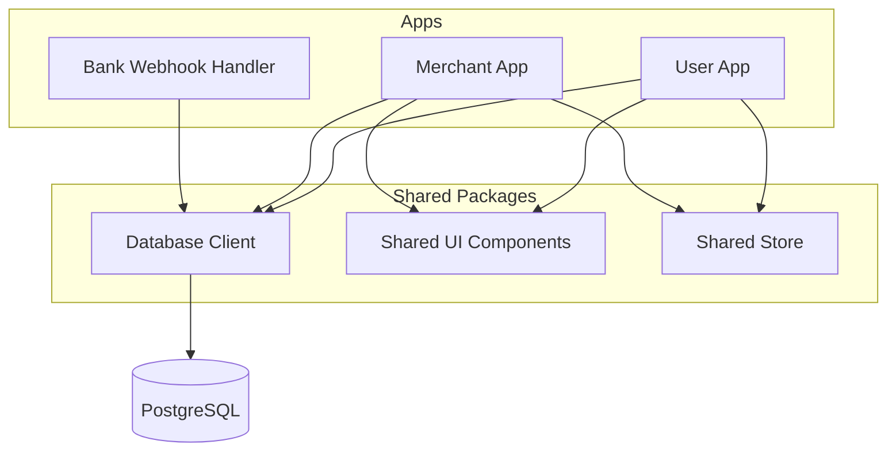
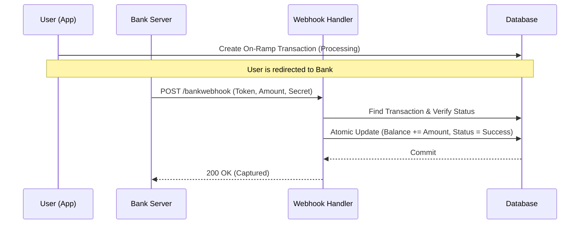
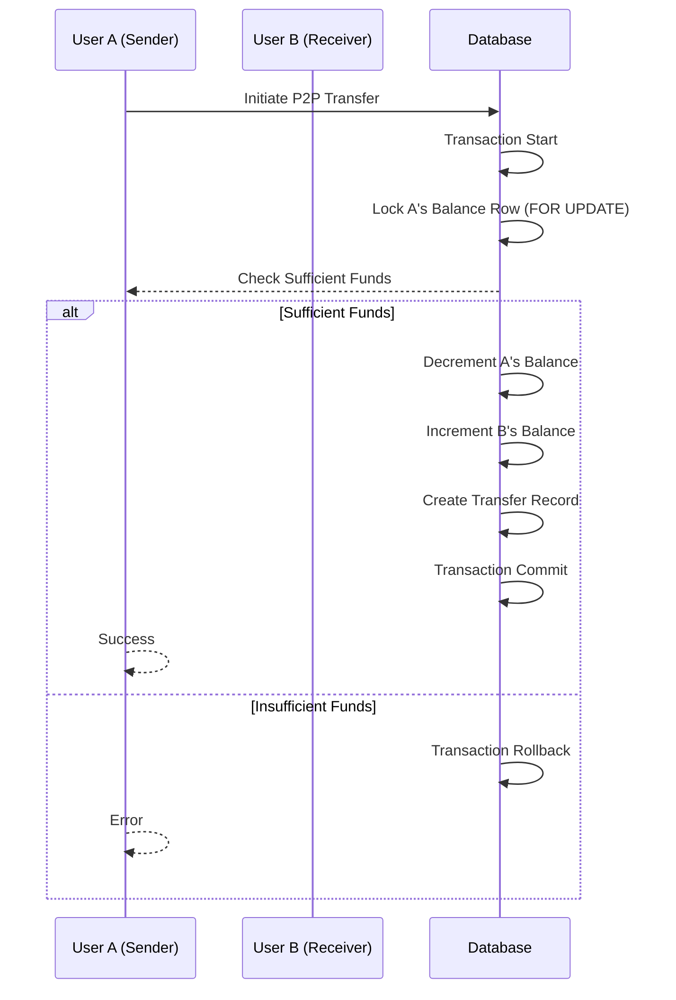

# MoneyTxn - Digital Wallet Monorepo

MoneyTxn may be a digital wallet application, but it's built with a modern, scalable tech stack designed for production. This monorepo contains user and merchant applications, along with a dedicated webhook handler for bank transactions.

## 🏗️ Architectural Idea
The core idea behind MoneyTxn is to provide a secure, scalable, and atomic transaction system. It follows a **Production-Ready Monorepo** pattern, separating concerns into individual apps (User App, Merchant App, Webhook Handlers) while sharing core logic (Database, UI, Configuration) through packages.



## 📂 Project Structure
Built using **Turborepo**, the project is structured as follows:

```bash
MoneyTxn/
├── apps/
│   ├── user-app/            # Next.js app for end-users
│   ├── merchant-app/        # Next.js/React app for merchants
│   └── bank-webhook-handler/ # Express service to handle bank callbacks
├── packages/
│   ├── db/                  # Prisma schema and shared DB client
│   ├── ui/                  # Shared React component library
│   ├── store/               # Shared state management (Recoil)
│   ├── tsconfig/            # Shared TypeScript configurations
│   └── eslint-config/       # Shared ESLint configurations
└── docker/                  # Dockerization scripts
```

## 🛠️ Tech Stack & Rationale

| Technology | Usage | Rationale |
| :--- | :--- | :--- |
| **Next.js (App Router)** | User/Merchant Apps | Server-Side Rendering (SSR) for SEO, Server Actions for secure DB mutations, and optimized routing. |
| **TypeScript** | Language-wide | Ensures type safety across the entire monorepo, reducing runtime errors. |
| **PostgreSQL** | Primary Database | Relational database with strong ACID properties, essential for financial transactions. |
| **Prisma** | ORM | Type-safe database access and easy migration management. |
| **Express** | Webhook Handler | Lightweight and fast for handling asynchronous bank notifications. |
| **NextAuth.js** | Authentication | Standardized, secure authentication with support for multiple providers. |
| **Tailwind CSS** | Styling | Rapid UI development with a utility-first approach. |
| **Recoil** | State Management | Fine-grained state control for complex UI interactions in the apps. |
| **Turborepo** | Build System | Optimizes builds and task execution across multiple packages and apps. |

## ⚙️ System Design & Core Flow

### 1. On-Ramping (Adding Money)
The system uses an asynchronous webhook-based approach to add money from a bank.

1.  **Request**: User initiates a transaction in the `user-app`.
2.  **Pending State**: An `OnRampTransaction` is created with status `Processing`.
3.  **Webhook**: The bank server sends a POST request to `bank-webhook-handler`.
4.  **Atomicity**: The webhook handler uses a database transaction to increment the user's balance and mark the transaction as `Success` simultaneously.



### 2. P2P Transfer (User-to-User)
To prevent "Double Spending" and ensure data consistency, the system uses **Database-Level Row Locking**.

- **Mechanism**: `SELECT ... FOR UPDATE` in a Prisma raw query prevents concurrent modifications to the same balance row.
- **Atomicity**: Increments, decrements, and transaction logging happen within a single ACID-compliant database transaction.



## 🔒 Security & Performance
- **Webhook Secrets**: Validated on every request to `bank-webhook-handler`.
- **Atomic Transactions**: Guarantees that money is never "created" or "lost" during transfers.
- **Monorepo Efficiency**: Shared packages ensure consistency across User and Merchant platforms.
- **Row Locking**: prevents race conditions when multiple transfers happen simultaneously.

## Getting Started

Follow these steps to set up the project locally.

### Prerequisites

- [Node.js](https://nodejs.org/) (v18 or higher)
- [Docker](https://www.docker.com/) (for running the database)
- [npm](https://www.npmjs.com/)

### Installation

1.  **Clone the repository:**
    ```bash
    git clone https://github.com/yourusername/MoneyTxn.git
    cd MoneyTxn
    ```

2.  **Install dependencies:**
    ```bash
    npm install
    ```
    *Note: If you encounter issues, try `npm install --legacy-peer-deps` or ensure you are using the correct Node version.*

### Database Setup

1.  **Start the PostgreSQL container:**
    ```bash
    docker-compose -f docker/docker-compose.yml up -d
    ```

2.  **Generate Prisma Client:**
    This command generates the Prisma client based on your schema and ensures the database is in sync.
    ```bash
    npm run db:generate
    ```
    *This script usually runs: `cd packages/db && npx prisma generate && cd ../..`*

### Running the Applications

You can run individual apps or the entire monorepo in development mode.

**To run all applications:**
```bash
npm run dev
```

**To run a specific application (e.g., user-app):**
```bash
npm run start-user-app
```
*Or navigate to the app directory and run `npm run dev`.*

## Deployment

The application is container-ready. Each app has its own compilation process.
- **CI/CD**: Build pipelines can be configured using GitHub Actions or your preferred CI tool.
- **Build**: Run `npm run build` from the root to build all apps and packages.

## Contributing

1.  Fork the repository.
2.  Create a feature branch (`git checkout -b feature/amazing-feature`).
3.  Commit your changes (`git commit -m 'Add some amazing feature'`).
4.  Push to the branch (`git push origin feature/amazing-feature`).
5.  Open a Pull Request.
